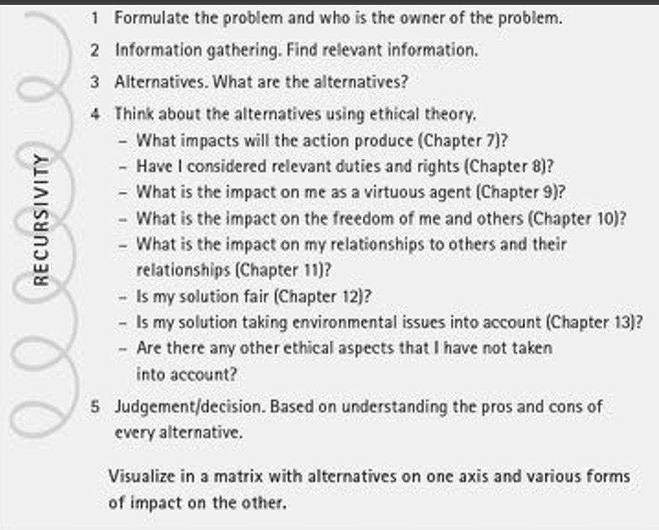
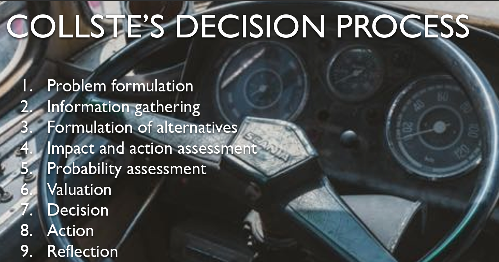
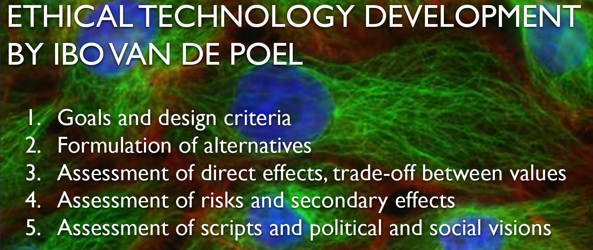
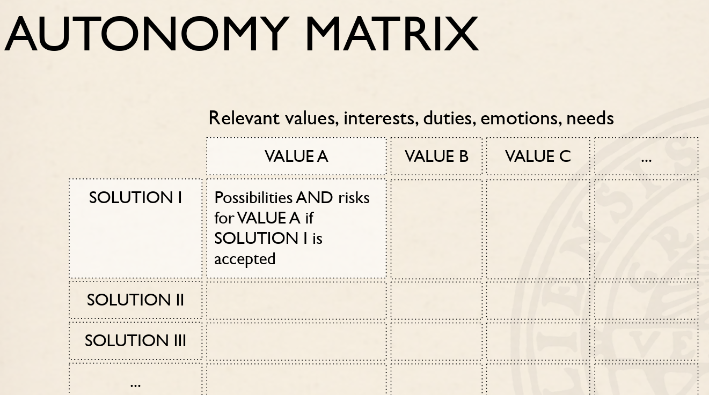
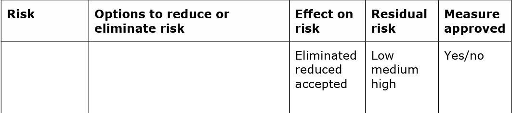

GDPR

The General Data Protection Regulation (GDPR) is a comprehensive data protection and privacy regulation that came into effect in the European Union (EU) on May 25, 2018. It governs the collection, use, and processing of personal data and is designed to give individuals greater control over their personal information. GDPR is built on several key principles:

1. Lawfulness, Fairness, and Transparency: Personal data must be processed lawfully, fairly, and transparently. This means individuals must be informed about how their data is being collected and used, and the processing must comply with applicable laws.

2. Purpose Limitation: Personal data should only be collected for specified, explicit, and legitimate purposes. It should not be used for purposes that are incompatible with the original reason for which it was collected.

3. Data Minimization: Only the minimum amount of personal data necessary for the intended purpose should be processed. Data controllers should avoid collecting excessive or irrelevant information.

4. Accuracy: Personal data should be accurate and kept up to date. Data controllers are responsible for taking reasonable steps to ensure the accuracy of the data.

5. Storage Limitation: Personal data should be stored for no longer than is necessary for the purposes for which it was collected. Data retention periods should be defined and adhered to.

6. Integrity and Confidentiality: Data controllers are responsible for protecting personal data against unauthorized or unlawful processing, as well as accidental loss, destruction, or damage. Security measures should be in place to ensure data integrity and confidentiality.

7. Accountability and Transparency: Data controllers are required to demonstrate compliance with GDPR and be able to provide evidence of their data protection practices. Transparency involves providing individuals with information about how their data is being processed.

8. Data Subject Rights: GDPR gives individuals various rights, including the right to access their data, the right to have inaccurate data corrected, the right to have their data erased in certain circumstances (the "right to be forgotten"), and the right to object to the processing of their data.

9. Lawful Basis for Processing: Data processing must be based on a lawful basis, such as the consent of the data subject, the necessity of processing for the performance of a contract, compliance with a legal obligation, protection of vital interests, the performance of a task carried out in the public interest or in the exercise of official authority, or legitimate interests pursued by the data controller.

10. Consent: If data processing relies on the data subject's consent, that consent must be freely given, specific, informed, and unambiguous. Data subjects have the right to withdraw their consent at any time.

These principles serve as the foundation of GDPR and guide organizations in their data processing activities, ensuring that individuals' privacy rights are protected and respected. Failure to comply with GDPR can result in significant fines and legal consequences for organizations that handle personal data.

## DPIA

**step1: identify the need**

project aims, processing

**step2: describe the processing**

how will you collect, use, store, delete data?

source? sharing? high risk processes?

scope of the processing

nature of data? special data? 

how much? how often? how long keep it?

how many people affected? geographical area involved?

context of processing

relationship between data providers and collectors?

how much control of providers

what’s their expectations

children and 特殊群体 in providers?

purpose of processing

aims? effect? benefits?

**step3:consult with relevant stakeholders**

**Step 4: Assess necessity and proportionality**

Describe compliance and proportionality measures, in particular: what is  your lawful basis for processing? Does the processing actually achieve your  purpose? Is there another way to achieve the same outcome? How will you prevent  function creep? How will you ensure data quality and data minimisation? What  information will you give individuals? How will you help to support their rights?  What measures do you take to ensure processors comply? How do you safeguard  any international transfers? 

**Step 5: Identify and assess risks**

Describe source of risk and nature of  potential impact on individuals

Likelihood  of harm  Severity  of harm  Overall  risk  

Remote,  possible or  probable 

Minimal,  significant  or severe  

Low,  medium  or high 

**Step 6: Identify measures to reduce risk**

Identify additional measures you could take to reduce or eliminate risks  identified as medium or high risk in step 5

**Step 7: Sign off and record outcomes**

### Case1

**1. Ownership and Intellectual Property:**

If the code produces a benefit, then the code belongs to the company. If the code creates a dispute, then the code belongs to the individual

   - Arguments for xAMS:
        - signed the contract and in the contract there is a term that claimed the ownership
     - Tina developed the prototype during her employment at xAMS, company owns the intellectual property rights to her work.
     - If Tina was a full-time employee or even an unpaid intern, there might be a presumption that her work during her tenure belongs to the company.
     - If Tina used company resources, including computing clusters, to develop her project, it could strengthen xAMS's claim to ownership.
   - Arguments for Tina:
     - Tina might argue that she developed the prototype during a hackathon, which was intended to be a creative and playful event, and therefore her project was not part of her regular job duties.
     - She could also assert that she used her own time and effort to create the project.
     - Tina's copyright claim could be strengthened if she had not signed a software development contract specifically assigning her work to the company.

**2. Similarity to Seth Vargo and Chef Case:**

   - Drawing analogies with the Seth Vargo and Chef case can provide insights into the ethical dimension. It highlights the importance of considering ethical implications when companies repurpose employees' work without their consent.

**3. Business Competitiveness and Product Development:**
   - The fact that the LAMS product line was not a competitive business when Tina developed the system might have some relevance, but it should not be the sole determinant of ownership.
   - It's important to consider whether Tina's work played a crucial role in identifying the market opportunity.

**4. Software Development Contract:**
   - Whether Tina signed a software development contract with xAMS can significantly impact the ownership dispute. Such contracts often specify the ownership of intellectual property created during employment.
   - The absence of a signed contract could be in favor of Tina, but the company might argue that it had standard employment terms that cover such situations.

**5. Jurisdiction and Location of the Company:**
   - The country in which the company is located can affect the legal framework and regulations governing intellectual property rights. Different countries may have varying interpretations of copyright laws and employment contracts.
   - The location of the legal dispute may determine the outcome.

**6. Employment Status:**
   - Tina's employment status, whether as a full-time employee or unpaid intern, may affect the company's claims to her work. Full-time employees often have their work automatically assigned to the employer, while unpaid interns may have a different legal status.

**7. Use of Company Resources:**
   - If Tina used xAMS's computing clusters or other resources for her project, the company might argue that this indicates the project's connection to her employment and the company's infrastructure, potentially strengthening their ownership claim.

In conclusion, this case involves a complex interplay of legal and ethical considerations. While it is challenging to reach a legal conclusion without all the facts, it highlights the importance of clear employment contracts, ethical treatment of employee creations, and the need for transparent ownership agreements, especially in cases of creative work developed outside of standard job responsibilities. The outcome of this dispute could have implications for software development practices and employee-employer relationships within the tech industry.

### Case2

Performing a Data Protection Impact Assessment (DPIA) for using LAMS (Learning Activity Management System) on behalf of Future University is a crucial step to ensure that the implementation of the system complies with data protection regulations, especially GDPR. Here's a structured approach to conduct the DPIA:

**1. Describe the Processing Activity:**
   - Provide a detailed description of how LAMS works and the specific processing activities it performs, including data collection, analysis, and output.

**2. Identify the Data Processing:**
   - List the types of personal data being processed by LAMS. This may include video and audio recordings, internet traffic data, and any other data involved in sentiment analysis and natural language processing.

**3. Identify the Data Subjects:**
   - Identify the individuals whose data is being processed by LAMS, in this case, students attending seminars at Future University.

**4. Assess Necessity and Proportionality:**
   - Evaluate whether the processing of personal data is necessary and proportionate for the purpose of monitoring student engagement and contributions in seminars.

**5. Evaluate Risks and Impact:**
   - Identify potential risks and impacts on the rights and freedoms of data subjects. Consider risks related to privacy, data security, and potential bias in the AI model.

**6. Data Protection Safeguards:**
   - Describe the technical and organizational measures that will be implemented to safeguard the data, such as encryption, access controls, and data retention policies.

**7. Data Subject Rights:**
   - Explain how students' rights under GDPR will be respected, including the right to access, rectify, and erase their data. Clarify the process for students to exercise these rights.

**8. Legal Basis for Processing:**
   - Identify the legal basis for processing personal data. In an educational context, legitimate interest or consent may be applicable. Discuss why this legal basis is chosen.

**9. Minimization of Data:**
   - Explain how data minimization will be applied in data collection and processing to ensure that only necessary data is collected and used.

**10. Assess Impact on Vulnerable Groups:**
   - Consider the potential impact of LAMS on vulnerable or marginalized student groups and develop strategies to mitigate any adverse effects.

**11. DPIA Conclusion:**
   - Summarize the findings of the DPIA and provide a clear conclusion regarding the risks and safeguards related to the use of LAMS.

**12. Consultation with Stakeholders:**
   - Describe any consultations with relevant stakeholders, such as students, faculty, and data protection authorities, as part of the DPIA process.

**13. Documenting the DPIA:**
   - Ensure that the DPIA is well-documented, including all assessments, decisions, and actions taken to mitigate risks.

**14. Review and Update:**
   - Establish a plan for regular review and updates of the DPIA, especially when there are changes in the system or regulations.

**15. Data Protection Officer (DPO) Involvement:**
   - Consult the DPO, if applicable, for guidance and expertise in ensuring data protection compliance.

By performing a comprehensive DPIA, Future University can assess the impact of implementing LAMS on data protection and privacy. This assessment will not only help in complying with GDPR but also in adopting best practices for responsible data processing in an educational context.

### Case3

Performing an ethical analysis according to the **Autonomy matrix** and identifying legal issues in Case 3 is essential to understand the complexities and implications of using questionable data sources and an ML model of questionable origin. Let's analyze the situation and its ethical and legal aspects for different components:

**Component 1: ML Model and Data from the Undisclosed Authoritarian State:**

**Ethical Analysis (Autonomy Matrix):**
- **Opportunities:**
  - For xAMS: Access to a potentially powerful ML model and dataset that may enhance the performance of the LAMS system.
  - For the Engineering Team (You): Potential to improve the LAMS system quickly, meeting business goals.
- **Risks:**
  - For xAMS: Ethical concerns related to the origin of the data, including infringement on the privacy and rights of individuals in the dataset.
  - For the Engineering Team (You): Complicity in using data sourced unethically.

**Legal Issues:**
- **Privacy and Data Protection Laws:** The use of data collected in an undisclosed authoritarian state may violate data protection and privacy laws, both in the country of origin and internationally. GDPR, for instance, imposes strict requirements for the use of personal data, and this data may not meet those standards.
- **Legality of Data Acquisition:** The data was originally leaked by an activist hacker group, raising questions about the legality of the data's acquisition and usage.

**Component 2: Data from the Highschool and Unauthorized Access:**

**Ethical Analysis (Autonomy Matrix):**
- **Opportunities:**
  - For xAMS: Availability of data that might enhance the ML model's performance.
  - For the Engineering Team (You): The potential to use data that could lead to model improvement.
- **Risks:**
  - For xAMS: Ethical concerns regarding the use of data obtained illegally and without consent.
  - For the Engineering Team (You): Complicity in using data acquired through unethical and illegal means.

**Legal Issues:**
- **Data Privacy and Consent:** The use of student recordings and unauthorized access to student records without consent likely violates privacy and data protection laws.
- **Access and Unauthorized Recording:** The boyfriend's actions in recording students without their consent and accessing student records unlawfully raise legal concerns.

**Overall Legal Issues:**
- **Use of ML Model with Questionable Origin:** Both components involve the use of data and algorithms of questionable origin, which can potentially lead to legal challenges, especially if the origin of the data and algorithms is exposed or investigated.

In this case, there are ethical and legal concerns associated with the use of data and algorithms from questionable sources. While the engineering team may be tempted to use the available data to improve the ML model quickly, doing so could have serious implications related to data privacy, consent, and legality. It is essential for xAMS and the engineering team to thoroughly evaluate the ethical and legal risks before making a decision on the use of such data and to consult with legal experts to ensure compliance with relevant laws and regulations. The Autonomy matrix can help weigh the opportunities and risks for different stakeholders involved.

### Case4

The situation in Case 4 presents multiple challenges related to the accuracy, transparency, and communication of the LAMS (Learning Activity Management System) technology. Here are possible ways of handling the situation:

**1. Transparency and Communication:**
   - **Education and Expectation Management:** Communicate clearly with the university about the limitations of the system. Provide evidence of its impressive accuracy but also explain the absence of a theoretical basis for its functioning and the potential issues with future data variations.
   - **Joint Review:** Work with the university to collaboratively review the system's capabilities and limitations. Invite educators and technical experts to evaluate its performance.
   - **Honest Marketing:** Encourage the university to market the system honestly, ensuring that it doesn't make unfounded promises to teachers. Emphasize that LAMS is a valuable tool but not a full replacement for human assessments.

**2. System Improvement and Understanding:**
   - **Research and Development:** Allocate resources to research and development to understand the underlying mechanisms of the system's accuracy. This can help improve its performance and reliability.
   - **Continuous Testing:** Implement continuous testing and validation procedures to assess the system's performance on new and evolving data. Regularly update the system based on the evolving insights.
   - **AI Explainability:** Invest in AI explainability techniques to make the system more transparent and understandable.

**3. Academic Integrity and Cheating Prevention:**
   - **Ethical Guidelines:** Establish clear ethical guidelines for using LAMS in educational settings, including consequences for attempting to cheat the system.
   - **Student Education:** Educate students about the purpose and limitations of the system. Encourage honesty and uphold academic integrity.
   - **Data Variation Management:** Develop methods for handling variations in student behavior, including those trying to manipulate the system. This may involve a combination of technical and behavioral measures.

**4. Legal and Ethical Considerations:**

   - **Legal Review:** Consult legal experts to ensure that the university's use of the system aligns with relevant laws and regulations, especially regarding data privacy and academic integrity.
   - **Data Privacy:** Ensure that the system is compliant with data privacy regulations, especially if it involves recording and processing student behavior.
   - **Ethical Evaluation:** Conduct an ethical evaluation of the system's use in educational settings, considering potential biases, fairness, and privacy implications.

**5. Continuous Monitoring:**
   - **Ongoing Assessment:** Continuously monitor and assess the system's performance and reliability. Regularly update the university and teachers with accurate information about its capabilities and limitations.

**6. Professional Ethics:**
   - **Engineering Ethics:** Engineers involved in the project should consider their professional ethics. If they have concerns about the reliability or ethical implications of the system, they should communicate these concerns within the team and to the university.

Overall, the key to handling this situation is to balance the impressive accuracy of the system with transparency about its limitations. It's important to manage expectations, prioritize ethical considerations, and invest in research and development to continuously improve the technology. Collaboration with the university and open communication will be essential to navigate this complex scenario responsibly.

These questions address critical aspects of the situation in Case 4 related to accountability, ethical values, legality, and principles of trustworthy AI. Let's delve into each of these questions:

**1. What does the accountability/liability distribution over a black-box system look like?**

In the context of a black-box system like LAMS, accountability and liability can be complex. Responsibility may be distributed among various stakeholders, including the engineers, the university, and the developers of the system. Here's what the distribution may look like:

- **Engineers:** Engineers have a responsibility to ensure that the system operates as intended and to the best of their knowledge. They should follow ethical engineering practices, conduct thorough testing, and communicate system limitations to the university.

- **University:** The university is accountable for its use of the system and for ensuring that it aligns with educational and legal standards. If the university misuses the system or makes unfounded claims, it may bear legal and ethical responsibility.

- **Developers of the System:** The developers may hold some responsibility for the accuracy and reliability of the system. If the system's functioning is not understood and it does not meet its stated goals, the developers should work to address these issues.

**2. What responsibility do you, as an engineer, have when you know that the system does not fulfill the customer’s unwarranted expectations?**

As an engineer, you have ethical and professional responsibilities when you recognize that the system does not meet the customer's unwarranted expectations. Your responsibilities include:

- **Honesty:** Communicate honestly with the university about the system's limitations and the fact that it does not fulfill unwarranted expectations. Avoid misleading or making false claims.

- **Transparency:** Encourage transparency about the system's capabilities and limitations. Provide accurate information to help the university make informed decisions.

- **Ethical Concerns:** Raise ethical concerns within your team and with the university. If you believe that the system is not reliable enough to warrant the promises made, express your concerns.

- **Continual Improvement:** Work towards improving the system to better meet the customer's legitimate expectations while respecting ethical boundaries.

**3. What values are at stake in the deployment of LAMS?**

Several values are at stake in the deployment of LAMS:

- **Transparency:** Ensuring that the system's operations and limitations are transparent to users and stakeholders.
- **Privacy:** Protecting the privacy of students, particularly with regard to the system's data collection and analysis.
- **Academic Integrity:** Upholding the principles of academic integrity and preventing cheating in educational assessments.
- **Fairness:** Ensuring that the system is fair and does not lead to bias or discrimination.
- **Ethical Use of Technology:** Using technology ethically, which includes respecting data privacy and avoiding misuse.
- **Honesty and Truthfulness:** Maintaining honesty and truthfulness in communication with customers and stakeholders.

**4. Is it lawful for the university to use LAMS for entirely automating the assessment? Argue for your answer with reference to GDPR.**

Using LAMS for entirely automating the assessment must be in compliance with GDPR and other relevant data protection regulations. The key considerations include:

- **Consent:** Students' consent is essential for collecting and processing their data. If the automated assessment involves the collection and analysis of personal data, GDPR requires explicit consent from data subjects.

- **Data Minimization:** The university should ensure that only necessary data is collected for assessment, adhering to the principle of data minimization in GDPR.

- **Data Security:** Adequate security measures must be in place to protect the data from unauthorized access or breaches.

- **Purpose Limitation:** Data must be collected and processed for specific, legitimate purposes. The university must clearly state the purpose of using LAMS for automated assessment.

- **Accountability and Responsibility:** The university is responsible for ensuring GDPR compliance and should be accountable for the lawful use of the system.

**5. How should LAMS be (re)designed to conform with the principles of Trustworthy AI?**

To ensure that LAMS conforms to the principles of Trustworthy AI, consider the following:

- **Transparency:** Enhance the transparency of the system's functioning so that it is understandable and interpretable by stakeholders.

- **Accountability:** Implement mechanisms for tracking and attributing decisions and outcomes to the responsible parties.

- **Fairness:** Mitigate biases and ensure fairness in the system by addressing issues related to data quality and model fairness.

- **Privacy and Data Protection:** Strengthen data protection measures to ensure that personal data is treated with the utmost care and in accordance with applicable laws.

- **Ethical Guidelines:** Develop and adhere to a comprehensive set of ethical guidelines for the use of LAMS in educational settings.

- **Continuous Monitoring:** Implement regular assessments and audits to evaluate the system's performance, reliability, and adherence to ethical principles.

Conforming to the principles of Trustworthy AI ensures that the system is accountable, fair, transparent, and respectful of privacy and ethics in its deployment.

### Case5

Handling accusations of antisocial behavior and social exclusion in the workplace, while considering equal opportunities, requires attention to important nuances in the cases. Although there are similarities, the two cases should not necessarily be treated in the same way. Here are some important nuances  to consider:

**1. Unique Competence vs. Common Skill Set:**
   - The Lead AI engineer possesses a unique competence that is important for the company, while the other employee has a more common skill set. This distinction is significant because it affects the potential impact on the company's operations.

**2. Management Responsibility:**
   - The Lead AI engineer holds a level of management responsibility. Addressing social exclusion within the management team might have broader organizational implications compared to the Quality control team.

**3. Potential Underlying Issues:**
   - It's crucial to understand the underlying reasons for the accusations and social exclusion. Are there specific behaviors or incidents that led to these situations? Are there biases, prejudices, or personality conflicts involved?

**4. Equal Opportunities Lecture:**
   - The equal opportunities lecture likely emphasized the importance of promoting a workplace culture that is inclusive and free from discrimination. It might have discussed the responsibility of both employees and management in fostering such an environment.

**5. Fair and Equitable Handling:**
   - The cases should be handled fairly and equitably, but the approach may differ based on the unique circumstances of each case.
   - The company should address the social exclusion issue as a priority, ensuring that all employees have equal access to social activities and opportunities for collaboration.

**6. Inclusivity Initiatives:**
   - Consider implementing inclusivity initiatives that encourage team members to interact with each other, promoting a more inclusive culture.

**7. Collaboration and Communication:**
   - Open and constructive communication is essential. Encourage the involved parties to express their concerns, share their experiences, and work together to find solutions.

**8. Leadership Responsibilities:**
   - Leadership plays a critical role in setting the tone for inclusivity. Managers should lead by example and actively promote a workplace culture where all employees feel valued and included.

**9. Employee Assistance Programs:**
   - Provide support mechanisms like employee assistance programs for those facing social exclusion or experiencing difficulties with colleagues. Encourage counseling and conflict resolution.

**10. Legal Considerations:**
   - Ensure that the company's actions are in compliance with relevant labor laws and regulations. Discrimination, bullying, and social exclusion may have legal implications.

**11. Tailored Approaches:**
   - While there should be consistency in promoting an inclusive workplace, the approach for addressing social exclusion may need to be tailored to the unique circumstances of each case. The severity of the situation, the employees involved, and their roles within the company should be considered.

In summary, while the principles of equal opportunities should guide the company's response to these situations, it's important to recognize the nuances in each case. A one-size-fits-all approach may not be appropriate. Tailored, fair, and equitable solutions should be designed to address the specific needs and circumstances of the employees involved, with a focus on promoting inclusivity and a respectful workplace culture.

### Case6

The situation presented in Case 6 involves legal, ethical, and practical considerations related to GDPR and fair examination practices. Let's discuss the legal issues, the difference between ethical and legal aspects, and the potential consequences of different rulings for the future of LAMS:

**Legal Issues:**

1. **GDPR Article 22:** GDPR Article 22 provides individuals with the right not to be subject to automated decisions, including profiling, which significantly affect them. If LAMS played a decisive role in the student's course failure, it may indeed be considered an automated decision.

2. **Data Processing:** The use of LAMS involves the processing of personal data, including student interactions and performance data, which falls under the purview of GDPR. This includes considerations related to data protection, consent, and transparency in data processing.

3. **Equal Treatment:** The second student's claim of different criteria used in evaluation raises questions about fair examination practices, equal treatment, and consistency in grading.

**Difference Between Ethical and Legal Considerations:**

There can be a difference between what is ethically right and what is legally right in this situation:

- **Ethical Consideration:** Ethically, it is important to respect a student's right to opt-out of automated assessments and request human judgment. It is also ethical to ensure fairness and consistency in evaluation criteria for all students, as different criteria may be perceived as unjust.

- **Legal Consideration:** Legally, GDPR Article 22 grants the student the right to be assessed by a human, and the teacher's decision to provide an individual oral examination is compliant with this right. However, the legal implications of different evaluation criteria could depend on institutional policies and local education laws.

**Mitigation of Ethical and Legal Differences:**

To mitigate the difference between ethical and legal considerations, institutions should:

- Clearly communicate evaluation criteria and policies to students.
- Ensure compliance with GDPR by offering alternative assessment methods when automated systems are involved, as in the case of GDPR Article 22.
- Implement consistent grading and evaluation practices to uphold fairness and equal treatment.

**Consequences of Different Rulings:**

1. **Ruling in Favor of Student 1:** This would affirm the right of students to opt-out of automated assessments, as per GDPR Article 22. It could set a precedent for students to request individual assessments.

2. **Ruling in Favor of Student 2:** This would emphasize the importance of consistent evaluation criteria, which may encourage institutions to standardize grading practices.

3. **Balanced Ruling:** Balancing the rights of both students while ensuring fairness in evaluation criteria may set a precedent for resolving similar disputes in the future.

In the long term, different rulings can impact the future of LAMS in terms of compliance with data protection regulations and the need to provide alternative assessment methods. Institutions may need to develop clear policies that respect student rights while maintaining consistency in evaluation criteria to mitigate ethical and legal conflicts.

## Classification

1. **Privacy and Data Protection:** Cases involving the collection, processing, and sharing of personal data, and the application of data protection regulations like GDPR.

2. **Data Sources and Ethics:** Cases involving the use of data from questionable or unauthorized sources and the ethical considerations associated with data origins.

   Seminar 6: The right to read vs privacy.

   Data type:: some are more private and some are more public

   - *Ethical Issue:* Balancing the right to privacy with the benefits of data collection.
   - *Legal Issue:* Compliance with data protection laws (e.g., GDPR) to ensure data privacy and consent.

   - *Ethical Issue:* Ethical considerations when using data from questionable or unauthorized sources.
   - *Legal Issue:* Compliance with data protection laws and regulations when handling data with questionable origins.

3. **AI and Automated Decision-Making:** Cases focusing on the ethical and legal implications of AI systems, algorithmic bias, and the right to human intervention in automated decisions.

   Seminar 2

   Seminar 4

   - *Ethical Issue:* Ensuring transparency and fairness in AI algorithms, addressing algorithmic bias.
   - *Legal Issue:* GDPR Article 22 - The right to human intervention in automated decision-making.

4. **Inclusivity and Fairness:** Cases dealing with inclusivity, diversity, and the need for fair treatment in various contexts, such as grading or employee evaluations.

   Seminar 3: Bias and discrimination

   - *Ethical Issue:* Promoting inclusivity and fairness in data-driven decisions, grading, and hiring practices.
   - *Legal Issue:* Compliance with anti-discrimination laws and regulations to ensure equal treatment.

5. **Employee and Workplace Scenarios:** Cases that explore issues of employee rights, workplace ethics, and potential conflicts related to data usage within an organization.

   Black box, AI 结果可解释性 技术导致的不良后果来源于人类自身

   - *Ethical Issue:* Monitoring employee behavior and rights to privacy in the workplace.
   - *Legal Issue:* Legal responsibilities in the workplace, including data protection, surveillance, and discrimination laws.

6. **Education and Academic Integrity:** Cases concerning technology use in education, student privacy, academic integrity, and fair assessment practices.

   Seminar 1: Sci-Hub

   - *Ethical Issue:* Maintaining academic integrity in the age of online education and AI-assisted assessments.
   - *Legal Issue:* Data privacy rights of students and compliance with academic integrity regulations.

   

7. **Emerging Technologies:** Cases related to emerging technologies, such as blockchain, IoT, or biometrics, and their ethical and legal implications.

   - *Ethical Issue:* Ethical considerations surrounding emerging technologies like blockchain, IoT, and biometrics.
   - *Legal Issue:* Compliance with evolving regulations and standards for emerging technologies in data management.

8. **Cybersecurity and Data Breaches:** Cases that address cybersecurity, data breaches, and the legal responsibilities and ethical considerations in protecting sensitive information.

   Seminar 5:: GDPR, leaking data

   - *Ethical Issue:* Ethical responsibilities in protecting sensitive data and preventing data breaches.
   - *Legal Issue:* Legal obligations and liabilities in the event of data breaches, including data breach notification requirements.

合法 主权 - 地区合法尊重主权，多样性

负责 - 设计者对产品负责

透明 - 解释程序如何设计，数据收集的透明化，公共区域的摄像头要告知对象

公平 - 公平的背后是因果分析，是什么导致了当前情况不一致，是先天还是后天

可靠 安全 隐私 保障 

包容 - 多元化

AI 改变了人与技术的关系，从人使用技术，到人在AI技术中显得被动，AI交互中失去完全控制的自信

AI治理 -  敏捷Agile 联系se 是最佳的政企关系方式。政府和企业之间存在博弈关系，但技术发展过快导致治理者在制定规则中落后，导致catch up forever

There is a gaming relationship between government and business, agile which I learn from SE, incrementally change during the development process. Might be a better way to soften that. but technology is evolving too fast causing governors to lag behind in setting the rules, leading to catch up forever

数据偏见：trash in trash out, 算法决策作为数学公式的结果，缺乏对未来的想象力，而人类社会中，这种想象力是不可缺少的。人类的偏见是局部性的，AI的偏见是系统性的，会产生广泛的影响。

Algorithmic decisions, as the result of mathematical formulas, lack the imagination for the future that is indispensable in human society. Human bias is partial; AI bias is systemic and can magnify the influences.

隐私： 数据成为新石油Data is becoming new OIL.

### Solution

法律与道德的区别 -  胶体colloid dispersion, ethic solution. 

Let our society be the Solvent, the law and ethics are solutes. But laws produce colloid, while ethics produce solution. I like the punchline.

对法律的期待可以转移到技术上来，大家对法律寄予厚望比如GDPR，我们必须看到法律本身的特性，立法是一个缓慢的过程，需要诸多论证才能完善。

Expectations of the law can be transferred to the technology and ethics, people have high expectations of the law such as the GDPR, we must see the nature of the law itself, legislation is a slow process, need time to improve.

跨学科的研究和思考，有助于推动AI发展走向可靠和可持续

Cross-disciplinary research and thinking can help drive AI development towards reliability and sustainability

suicide attempt is a desire of survival

The difference between me and a corpse is that I still want to die. So based on syllogism, death seeking is a kind of vigour

**4. Education and Academic Integrity:**

- Discuss advanced proctoring solutions that protect student privacy and prevent academic misconduct.
- Explore the use of AI-powered tutoring systems that provide personalized learning experiences while respecting individual autonomy.

**5. Data Sources and Ethics:**

- Explore decentralized data marketplaces, where individuals have more control over their data and can grant access on their terms.
-  privacy-preserving techniques like secure multi-party computation for data sharing without revealing raw data.

**6. Inclusivity and Fairness:**

- leveraging AI for bias detection and mitigation.
- novel approaches to fair grading and evaluation that prioritize individual progress rather than competition.
- Propose data-driven mentorship and support programs to ensure equitable career advancement and professional development.

**7. Emerging Technologies:**

- Discuss the ethical considerations in biometric data usage and propose advanced encryption techniques for biometric templates.
- Highlight the importance of robust cybersecurity strategies and AI-driven threat detection in the adoption of emerging technologies.

**8. Cybersecurity and Data Breaches:**

- Discuss the use of advanced threat intelligence platforms that use AI for real-time threat detection and proactive security measures.
- Explore the concept of "data breach insurance" and how it can incentivize organizations to invest in robust cybersecurity.
- Propose a data breach response framework that includes automated incident response and damage control using AI.

### 稿子

**In this case,**

[Tina developed an impressive project during a hackathon, but it seems she's now in **a legal dispute with** her former employer, xAMS, over the project's use.]

【The use of cameras and microphones to assess student participation certainly raises some questions.】

**First and foremost,** 

[ it's not just a legal matter; there are several ethical aspects to consider. **For one,**  Tina claims copyright for her project. What do you think about her rights regarding the code she developed while employed at xAMS?]

**On the legal side**,

[ **this touches on the legal framework and intellectual property rights.** Tina's claim raises the question of who owns the code developed during company-sponsored events or while an employee is on the clock. Companies often have policies and agreements in place regarding intellectual property, which should be examined.]

[ This case emphasizes the need for transparency and accountability within companies. xAMS decided to use Tina's project for a new product line, but they didn't inform her or seek her consent. Ethically, should they have done that?]

[ transparency is key in such situations. xAMS should have communicated their intentions with Tina and sought her consent. This not only aligns with ethical practices but also helps maintain a positive and collaborative work environment.]

【Absolutely, and **it touches on a few key ethical aspects**. First, it's about data privacy and consent. In educational settings, student data privacy is paramount, and consent to record and assess their activity is crucial. Do you think LAMS respects these principles?】

【Ensuring that students' data privacy is respected and that proper consent is obtained is an ethical responsibility.  LAMS needs to be transparent about data collection and usage to uphold these principles.】

 **And let's not forget the potential implications on / Furthermore**

【Furthermore, using AI algorithms to evaluate students' participation could introduce bias or discrimination. It's important to consider fairness and equity in assessing students. **What's your take on this?**】

**So, in a nutshell, this case highlights** 

**[ the delicate balance between** innovation, ownership, transparency, and ethical responsibility within the workplace.]

[It's a reminder that addressing ethical and legal aspects in such conflicts is vital for fostering a culture of innovation while respecting employees' rights and contributions.]

AI可解释性

Been Kim mentioned a word in her speech: Fundamental Underspecification. The general meaning is that interpretability does not exist for a clear goal , but to ensure that some aspects are guaranteed by the interpretability itself. A simple example is security. We have no way to quantify safety into a goal, and then say that as long as we achieve this goal, vehicles will be 100% safe, because it is impossible for us to enumerate all uncertain and dangerous events and then optimize them uniformly. For model developers, we want to know the root cause of poor model performance, rather than continue to finetune. There are many such aspects, including the fact that current machine learning must have some ethical colors while ensuring high performance and high accuracy. For example, the classifier cannot use race, skin color, gender for classification, otherwise it will be labelled as discrimination.

Google Brain的Been Kim在她的演讲中提到一个词：**Fundamental Underspecification**（翻译无能）。大概的意思是，可解释性不是为了一个明确的目标（像是一个待优化的目标函数）而存在，而是为了确保一些方面因为可解释性本身而得到保障。一个简单的例子就是安全方面。我们没有办法把安全这个方面量化到一个目标，然后说只要我们达到这个目标，无人车就是100%安全，因为我们不可能枚举出所有的不确定性事件危险事件然后我们统一优化他们。而对于模型开发者来说，我们想知道模型性能不佳的根本原因，而不是持续炼丹。这样的方面还有很多，包括现在的机器学习在保证高性能高精确率的情况下，还要带有一些人文主义色彩。比如分类器不可以根据种族肤色性别作为分类的依据，不然的话就扣上歧视的帽子了。

对于可解释性的研究，个人认为是一个与AI行业有着密不可分的关系。很多人也许会觉得现如今的模型和算法已经远远超出了人类的极限，我们眼中的不可解释或许是它已远在我们的理解力之上，甚至认为人为的干预只会变成自动化（automation）的干扰项。但可解释性的必要性在于，它背后的理论是已人类为中心，反应的是我们该如何通过解释模型达到人类对模型的信任，从而创造更加安全可靠的应用，进而推动整个AI产业的进步。