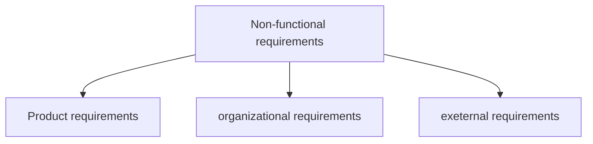

## Requirements

---

### Definition: 

Requirements are a specification of what should be implemented.

- Descriptions of how the system should behave, of a system property of attribute.
- Constraint on the development process of the sys

### User Requirements

#### Def

goal or task that *specific classes of users* **must** be able to perform with a sys or a <u>desired product attribute</u>


#### format

As a .. I NEED TO .. SO THAT..

#### User case

sequence of interactions between a system and external actor to achieve an outcome of value

系统与外部用户的一系列交互>>价值

#### User story

short description of a feature told from the perspective of who wants it from the sys

as a user role, I want to Do something so that Reason

#### User class

用户类型、分类

- subset of product’s customers
- an individual can belong to several classes
- each user class must have a set of requirements
- classes need not be human beings

#### What process to use

- user personas

  a description of a representative of a user class with similar characteristics and needs

- user representatives

  a suitable representative to provide the voice of the user

- product champion 产品经理

  an intermediary gathering requirements from the users

**in agile methods all user classes are represented by the Product owner**

### System Requirements

#### Def

Top-level requirement for a product

software or soft+hardware

#### Functional功能性需求

- behavior that a system will exhibit under specific conditions特殊情况下的系统表现
- describes *what* developers must implement to satisfy user requirements
- written as **shall** statements

#### Non-functional非功能性需求

- describe *how well* a system does what it must do
- quality standard of the system
- must be **measurable**

SLA、speed、security、ease of use, reliability, robustness, portability

```The system shall ..```



### Requirements Engineering

Requirements elicitation >> Requirements specification >> requirements validation >> system requirements document

requirements development is an iterative process

