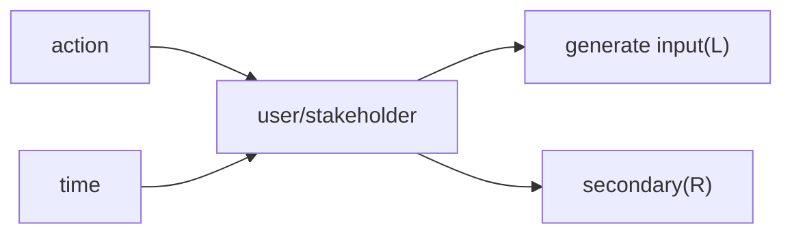

## Model
#### definition
- abstraction: remove detail, focus in viewpoint
- dynamic

### prototypes 原型
#### usage
风险降低
+ requirements elicitation
+ requirements validation
+ proof of concept
+ 信息反馈
#### difference between product

### UML


### UML sequence diagram
```
component/class []
life line -->[]--
-->|v|[life line] :call with value to start
<--|v|[life line] :return with value to end
组件/类的生命周期跟随调用和返回

框架 通常标注类型
frame: for/while/if
condition  -.-虚线划分条件空间


```


物理结构

client-service

构造简单

master-slave

负载均衡

避免单点故障

动态扩展

bus总线型

逻辑结构

top down

bottom up

MCV-jsp框架

driver属于m的扩展