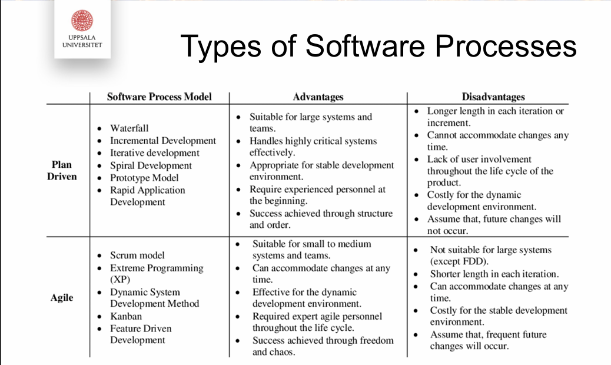

```java
//@description: notes of Software Engineering. title starts with * means key slide
//@reference: Software Engineering (Ian Sommerville)ed10
```

# Content

[TOC]


## C1

### *Software Engineering Definition

SE is about processes to create software. Concerned with theories, methods and tools.

Constrains

Time–Money–Organization

### Process-based approach to Quality 

#### *ACO X

**Assumptions**: quality of product is measurable

**Challenge**: quality of process is not measurable

**Opportunity**: cares of what should happen

#### *Describe the flow chat

```
processes are defined correctly, measure the quality of the product and change the process until achieve the quality level that you need. Finally, standardised the process.
```


#### Measure Product Quality and Direct Measure

- Acceptable: usable, learnable, compatible
- Dependable: safe, reliable, secure
- Efficient: response time, memory use
- Maintainable: documented, structured


#### *Software Process Activities

- Validation - Testing - ensure it is what customer requires
- Evolution - Delivery, Maintenance - evolve to meet changing customer & market requirements
- Specification - Requirements - define functionality and constrains
- Development - Design, Implementation - design and program

Order of these processes:

S >> D >> V >> E

#### *Types of Software Processes

- Plan Driven: planned in advance, measured against plan
- Agile: incremental planning, early feedback




### Plan-based software processes

#### waterfall model

takes the fundamental process activities as separate process phases.

plan-driven process:

​	plan and schedule all of the process activities before starting development, Progress measured against plan

Stages:


Drawback

- The following phase should not start until the previous phase has finished.
  
- not the right process model in situations where informal team communication is possible and software requirements change quickly

#### V-model(p60)

The V-model shows the software validation activities that correspond to each stage of the waterfall process model.


The process is an iterative one with information being fed back from later stages to earlier parts of the process.


#### Incremental Development

Interleaves the activities: specification, development, and validation activities are interleaved rather than separate, with rapid feedback across activities.

system is developed as a series of versions(increments), with each version adding functionality to the previous one.


Specification, development, and validation activities are interleaved rather than separate, with rapid feedback across activities.

Incremental software development, which is a fundamental part of agile 
development methods, is better than a waterfall approach for systems whose 
requirements are **likely to change during the development process.**

By developing the 
software incrementally, it is cheaper and easier to make changes in the software 
as it is being developed.

Incremental development has three major advantages over the waterfall model:

- The cost of implementing requirements changes is reduced. 
- It is easier to get customer feedback on the development work that has been done.
- Early delivery and deployment of useful software to the customer is possible, even if all of the functionality has not been included. 

two problems:

- The process is not visible.
- System structure tends to degrade as new increments are added. 

#### Reuse-based Development


Based around integration and configuration.

Has the obvious advantage of reducing the amount of software to be developed 
and so reducing cost and risks. 

relies on the availability of reusable components or systems.

develop process focuses on configuring the components for use in a new setting and integrating them into a system.

## C1.5

### Kanban

plan>>build>>test>>done


### waterfall

plan>>build>>test>>review>>deploy

plan before activities

lag behind market requirements
Product planning must be done before any subsequent work, and in most cases the planning process does not fully understand the project

### Scrum

sprint:

- plan>>build>>test>>review

Multi-tasking in vertical parallel reduces time at every stage from product to development and testing
Incremental releases >>  `sprints`.
A sprint usually takes only 1~3 weeks, repeating the sprint until the product is fully functional.
A sprint usually takes only 1~3 weeks, keep repeating the sprint until the product is fully functional

#### role

1.product owner
2.scrum master
3.scrum team

#### artifact 

##### 1.product backlog

prioritized list of features (user story)
evolve and change with every sprint

```
user story: As a ... I need.. So that..
allow PO to specify details for team to estimate size of tasks
```

##### 2.sprint backlog = todo list

##### 3.burndown chart

show the progress during a sprint on the completion of tasks in the sprint backlog
approach zero as the work is being completed

#### ceremony/conference

1.sprint plan
scrum master and team meet to discuss the user stories and estimate the relative sizes
2.daily scrum
a brief standup meeting
3.sprint review and retrospective
occurs at the end of the sprint

#### scrum workflow

product backlog
sprint planning
sprint backlog
sprint
potientially shippable product
sprint review and retropective


### scrum vs kanban
Key Differences:

Scrum uses fixed-length sprints with predefined goals, while Kanban is more flexible and allows for continuous flow.
Scrum has distinct roles (Product Owner, Scrum Master) and events (Sprint Planning, Daily Scrum), whereas Kanban is less prescriptive about roles and events.
Scrum prioritizes a fixed set of user stories for each sprint, while Kanban focuses on managing the flow of work items without predefined iterations.

### Kanban vs. Waterfall

##### role

agile coach = scrum master

##### common

both **pull system**
flexible

##### difference

kanban is a continues system, no sprint or sprint backlog
the pull system in kanban >> work in progress limit (WIP, eg. lean time)
scrum is the complete agile methodology, kanban is a tool

### Purpose ( why agile )

Agile emerged as a solution to the problems encountered with traditional project management methods

### V Model vs. Waterfall

| v                                                         | w                                           |
| --------------------------------------------------------- | ------------------------------------------- |
| carers about quality from the begining                    | checks quality in the middle of the process |
| easier to correct mistakes(go back to earlier activities) | do not go to the previous activity          |
|                                                           |                                             |
| both plan driven                                          |                                             |


### Combination

Scrumban: backlog+WIP limit+sprint

## C2 

### Requirement Engineering - Type of req

Requirements are about WHAT, not HOW.

### *Definition

Requirements are a specification of what should be implemented.  They are descriptions of **how the system should behave (Functional)**, or of **a system property or  attribute (Non-Functional)**.

### Roles

- Stakeholder: is actively involved in a project. external or internal

- Customer

- User(aka end user)

### User Requirements

#### *Def

goal or task that specific classes of users must be able to perform with a system or a desired product attribute


#### format

As a .. I NEED TO .. SO THAT..

#### User case

sequence of interactions between a system and external actor to achieve an outcome of value

#### User story

short description of a feature told from the perspective of who wants it from the sys

as a user role, I want to Do something so that Reason

#### User class

- subset of product’s customers
- an individual can belong to several classes
- each user class must have a set of requirements
- classes need not be human beings

#### What process to use

- user personas

  a description of a representative of a user class with similar characteristics and needs

- user representatives

  a suitable representative to provide the voice of the user

- product champion 产品经理

  an intermediary gathering requirements from the users

**in agile methods all user classes are represented by the Product owner**

### System Requirements

#### *Def

Top-level requirement for a product

software or soft+hardware

#### *Functional

- behavior that a system will exhibit under specific conditions
- describes *what* developers must implement to satisfy user requirements
- written as **shall** statements

#### *Non-functional

- describe **how well** a system does what it must do
- quality standard of the system
- must be **measurable**

##### *Categoriy


SLA、speed、security、ease of use, reliability, robustness, portability

```The system shall ..```


### Requirements Engineering -  Process

#### process 1

Requirements elicitation >> Requirements specification >> requirements validation >> system requirements document

#### *process 2


The total requirements effort might not be much different for projects of comparable size that follow different life cycles, but the timing distribution of requirements work is very different.

- Waterfall life cycle: plan to do only one major release, so most of the effort is allocated for the beginning of the project

- Iterative development process: work on requirements on every iteration through the development process, with a heavier emphasis in the first iteration

- Agile:  have frequent but small requirements development efforts,

### Elicitation

#### output of req development

Developers have a common understanding of the needs of stakeholders.

#### method

- interview
- workshops
- etc

### Specification

Use: natural language + models

Structured as use cases

### Validation

#### statement verification

- complete
- correct
- feasible
- necessary

#### collection verification

valid, realistic, complete, consistent, verifiable

## C3

### Models ( != Prototypes )

used to understand some aspect of system

### Prototypes ( are Models )

 fully functional “first try” of system

### UML

- component diagram - context type
- use case diagram - interaction type
  - show the interactions between a system and its environment.
- sequence diagram - interaction type
  - show interactions between actors and the system and between system components.
- class diagram - structure type
  - show interactions between actors and the system and between system components.
- state diagram - behavior type
  - show how the system reacts to internal and external events.
- activity diagram - behavior type
  - show the activities involved in a process or in data processing.

## C4

### Architectural design

Software vs. System Design

| Software                   | System Desing            |
| -------------------------- | ------------------------ |
| Decomposition into layers  | Distribution             |
| Decomposition into modules | Replication              |
| Interaction patterns       | Business process support |


### Structured Design Methods 

Asking the right questions

Top-down / bottom-up

Stepwise refinement (agile) 

Structured design 

Object-oriented design

Objects model real-world & program entities

Classes & interfaces capture commonalitie

### *Model for Design Process


Architectural Patterns 

Advantages

Common language / understanding of system

Help to understand legacy systems

Reuse of design

### *Physical Architecture

#### client-service

the system is presented as a set of services, with each service 
delivered by a separate server. Clients are users of these services and access servers to make use of them.

- easy to extent
- secure
- bottleneck: network


#### *master-slave


if one or more slaves die, the master can keep working

- dedicated processes(slaves)
- great for real-time systems
- avoid single point failure
- bn: not so extensible /  secure


A traffic control system in a city has three logical processes that run on separate processors. 

The master process is the control room process, which communicates with separate slave processes that are responsible for collecting traffic data and managing the operation of traffic lights.

#### Distributed component 


- Allows system designer to delay decisions on when/how services are  provided
- Flexible / scalable / extensible / auto-reconfiguration
- bn: Complex, no universal standards 


### *Logical

#### *Layered Model Architecture

- Used to model interacting subsystems 

- Organizes system into set of layers

- Each layer provides only a set of services 

- Supports reuse

  Changes in one layer does not affect others 

  Layers can be merged / splitted 

- Drawback:

  Too simple 

  Performance: Needs to bypass layers

#### *Model-View-ControllerArchitecture

- Separates presentation / interaction / data

  Data can change independently of its representation

  Allows presenting same data in multiple ways

- Too simple

  Might involve extra coding (specially with simple  models)

  Requires to adapt the logical architecture


#### *2-Tier Architecture


Thin: simple client, security; server load 

- where the presentation layer is implemented on the client and all other layers (data handling, application processing, and database) are implemented on a server. 
- The client presentation software is usually a web browser, but apps for mobile devices may also be available.

[+]simple to manage the clients.

[-]it places a heavy processing load on both the server and the network

Fat: less server load; need to install client, bad security(raw data)

- where some or all of the application processing is carried out 
  on the client. 
- Data management and database functions are implemented on the server. In this case, the client software may be a specially written program that is tightly integrated with the server application.

[+]more effectively

#### *3-Tier Architecture

- scalable, best of two worlds
- drawbacks: double network delays, complex


### Reengineer/replace/refactor

Think: what, why & why not, when

#### benefition

less effort, tried and understood(Less process risk, Dependability, Standards compliance)

#### Process


#### Reengineering vs. Refactor

Re-engineering: making fundamental changes

e.g. porting, transaltion, migration

Refactor: changes in code without changing behavior


#### Question mentioned in class

```
component in master slave structure. 

master slave structure com and diff with layered structure.

example of software application of master slave structure.

could master slave combine with layer? give example.
```

## C5

### Risk management

risk: potential problem that may or may not occur in the  future

hazard: any source or cause of potential damage: risks.

#### Types

Project risks affect the project schedule or resources. 

Product risks affect the quality or performance of the software being developed.

Business risks affect the organization developing or procuring the software.

#### Process


1. Risk identification 
   You should identify possible project, product, and business risks.
2. Risk analysis 
   You should assess the likelihood and consequences of these risks.
3. Risk planning 
   You should make plans to address the risk, either by avoiding it or by minimizing its effects on the project.
4. Risk monitoring 
   You should regularly assess the risk and your plans for risk mitigation and revise these plans when you learn more about the risk.

### strategies

1. Avoidance
2. Minimization
3. Contingency

## C6 

### Validation & Verification

#### *Def

Validation:

is the process of evaluating software  during or at the end of the development process to determine  whether it satisfies specified requirements

- Will the product satisfy the customers needs?
- Are webuilding the right product?

Verification

is the process of evaluating software to  determine whether the products of a given development phase  satisfy the conditions imposed at the start of that phase. 

- Do wesatisfy the requirements?
- Are webuilding the productright?

#### V-Model


### Test-Driven Development TDD

#### Def

an software  development approach in which a test is written before  writing the code. Once the new code passes the test, it is  refactored to an acceptable standard.


Test first, then develop

Incremental test development from scenarios

User involvement in testdevelopment and validation

Uses automated testing frameworks

### Behavior-Driven Development (BDD)

Agile process based on Domain-driven Design (DDD) 

Understand first, then develop

Incremental test development from scenarios

Product owner involvement in domain designand validation

Uses automated testing frameworks

### *Domain Model

Static visual representation that illustrates  meaningful concepts from a specific domain


### *Test vs. Inspection

Test: Dynamic - running a program

Inspections: Static - -reviewing a document


### Test

#### Def.

A test suite is a set of tests run together for a single  purpose

#### Classification

- Classification by goal: Finding defects, Acceptance / Validation, Measurement: reliability, performance

-  Classification by level: System, Subsystem, Module

### Acceptance Test(System)

#### Goal

contract fulfuiled? (verification) 

product usable?(validation)

### ReliabilityTest (System/Component)

#### Goal

To check the normal operation of the system/component

Steps: estabilish the operation profile. construct test data reflecting the operational profile(statistically), test, compute the reliability after a statistically significant number of failures

#### Requires

Test data reflecting the normal operation, Statistical randomized method

### PerformanceTest(System)

#### Stress test - verification

(how system handles increasing / extreme  load)

Graceful degrading / total collapse

Many reveal defects 

answer: some numbers

#### Load test (profiling) - validation

Ex: 10% code takes 90% of the time

find bottleneck in the code

answer to load test : yes or no?

### IntegrationTest(Interface)

- Top-down vs. Bottom-up 
- Needs mocks for unfinished parts


### ReusabilityTest (System/Component)

Back-to-back testing

- Use previous version of the system (or prototype) as oracle

Regression tests

- Applies to all kinds of tests
- Rerun a test suite for every change in the system/component
- Goal: did the change break anything?

### Assess Test

#### Goals

- To detect as many defects as possible
- To detect the most damaging defects
- To detect the most likely defects 

#### *Types

| Black-box                                         | Glass-box                                             |
| ------------------------------------------------- | ----------------------------------------------------- |
| source code is not considered (only requirements) | tests are chosen based on the source cod              |
| Partition testing on (I/O)                        | All code should be tested at lest once(CODE COVERAGE) |

## C7

### *Maintainance


### *Assessment


### *Continuous Integration

#### Pros

Problems between developers discovered and repaired as soon  as possible

The most recent system in mainline is definitive working system

#### Cons

Large system takes time to build and test

Not possible to run system tests in developer’s private  workspace: development platform different from target platform. 

### *Quality Management


#### why quality planning is important

 ```
The quality plan should set out the desired software qualities and describe how these qualities are to be assessed. Engineers, therefore, have a shared understanding of the most important software quality attributes
 ```


#### *the importance of standards in the quality management 

1. Standards capture wisdom that is of value to the organization. Building it into a standard helps the company reuse this experience and avoid previous mistakes.
2. Standards provide a framework for defining what quality means in a particular setting. 
3. Standards assist continuity when work carried out by one person is taken up and continued by another. Standards ensure that all engineers within an organization adopt the same practices. Consequently, the learning effort required when starting new work is reduced.

### *Q

how standards are used in quality assurance

how reviews and inspections are used as a mechanism 
for software quality assurance

#### Quality Assurance

Involves the manufacturing process

Based on quality standards

Defines required measurements

#### Quality Control

Consists on carrying out product andprocess measurements

Allows us to react according to plan

### *Pair Programming

Code review happens naturally, as the other pair member reads  what is written.

Advantages: Everything is read by 2 people 

Disadvantages:No benefit of distance, Expensive

### *Over-the-shoulder

One programmer presents their work to a reviewer. The  programmer is at the keyboard and walks the reviewer through the  code. 

Ad: light weight, can be used selectively, explanations are readily available

Disad: Little time for reflection, Easy to over-explain, Coverage not guaranteed

### *Peer Review

The reviewer inspects a chunk of source code of the programmer,  and comments on it.

Advantages: Gives time for reflection, Can be on demand, Highlights code documentation issues Disadvantages: Can be seen as adversaria

### *Pre-checking

Every check-in is inspected by the owner of the module  before being accepted

Ad: everything is inspected, check-in message gives context, knowledgeble reviewer, frequent reviews

Disad: time consumption, legacy, tools needed

### *Formal Meeting

Several reviewers and programmers sit together for a meeting to  discuss previously inspected code.

Advantages: Many eyes on the code, Can handle large change sets, Observer friendly

Disadvantages: Schedule meetings is hard / expensive, Group dynamics and ego concern

## C8

### Team dynamics

An important aspect ofeffective teamwork entails understanding group  dynamics in terms of both team situation and individual temperament.

### Models

#### *Tuckman Team Model

Describes the 4+1 stages teams pass while moving from  organizingto producing.

Stages are not linear. Teams move back and forward  based on

- Events influencing the team (e.g., conflict resolution)

- Communication strategie


1. Forming组织阶段

   know each other, make good impression, create shared expectations, guidelines, boundaries

2. Storming

   preliminary boundaries and expectations are challenged, learn about each other’s motivation

3. Norming

   conflicts solved, teammates have proved flexible. everyone knows its role and works on their part of the project.

   problems: does not understand their role. expectation is unclear. overall goal is unclear.

   risk to go back to forming and storming.

   group cohesion ensures everyone is responsible to the task and to each other

4. Performing

   developed a synergy after working together long enough, processes in place

5. Adjourning

   go each on our ways


#### *GRIP Model


- outlines  interrelated components of highly effective teamwork
- each component influences the following (clockwise

Goals: everyone must understand and be fully committed to the goals and the organization

individual goals must be aligned to establish: trust, make progress, achieve outcomes

Roles: everyone in team knows

- what part they play
- what is expected
- how they are going to be held accountable/responsible

Interpersonal: 

high quality of communication and collaboration to increase trust

sensitivity and flexibility to deal with conflict and to make progress

processes:

defined systems for  how decision are made, how the teams solves problems and addresses conflicts

defined systems and procedures for completing the project

#### *Comparison

| T                                       | G                             |
| --------------------------------------- | ----------------------------- |
| group                                   | do not have phases of a group |
| communication focus on different things |                               |
| both have an overall goal               |                               |


## Exe1

### 1

During the course we discussed some software engineering processes (Waterfall, V-model, etc.). What are desirable properties for a process?

Feedback:

```
General Feedback

So that the process is actually used as intended, it should be understandable, acceptable and supported.

So that the process is managable, it should be visible, robust and preferably also measurable.

So that the process gives good results, it should be reliable, and rapid (other good points are user involvement, allow parallism, incremental, manage risks).

Note: some answers start to explain the V-model, or the phases requirements, design, ... and so on. That is not answering the question
```

### 2

What are the advantages of the V-Model, compared to other Software Engineering process models?

```
General Feedback
Advantages of the V-model is that it's simple, understandable, easy to follow for those in the project (compare to other processes we discussed). 

The V-model is also visible (you know where you are) which makes it relatively easy to manage.

The V-model is not incremental/iterative. This is usually a disadvantage, but for small projects with low risk (done similar projects before, little user interaction) this may be more cost-effective. 

The V-model has a testing focus. System and integration test plans can be made before or during implementation. 

NOTE: similar questions or reflections can be derived from the other processes we discussed in class.
```

### 3

Explain the concepts of Validation and Verification, then describe how both can be done.

```
General Feedback
Validation compares the product to the customer needs: are we building a product that is what the customer intended - are we building the right product? Verification compares the product and the process to the specification: are we following the correct process, quality plan, requirements specification, architectural design - are we building the product right? 

Verification of the requirements specification means that we check that it satisfies the standards and rules that apply for requirements specifications. For example:

All terminology is defined in the glossary

All requirements are classified and numbered according to the predefined company scheme

Traceability is ensured (again according to the predefined company scheme)

Version control is enforced.

Documents are signed by the project manager and the customer.

In general, relating V&V with testing and inspection is always a good way to answer the question.
```

### 4

The following diagram details a particular process, in UML, that we have discussed in class. Take a look at the picture and:

 

1. Describe the following process in your own words (0,5 pt).
2.  Explain why is it important (0,5 pt)

```
General Feedback
There is no concrete definition that we expect from you when describing the process, but there are some elements that your answer should have included:

We measure the quality of the product instead of the quality of the process, because we don't know how to do the second.

As engineers our goal is to standarize good processes so we can be more efficient the next time we have to do the same task.

This is an important process because has an assumption - that good quality products can only be achieved following good quality processes - that sometimes might not be true.
```

### 5

Below you can find some attributes. Some of them are valid measures to assess the quality of a product. Which ones?

```
Incorrect answer:

Robust to problems
Efficient
Dependable

Correct answer:
Usable
Secure
Reliable
Safe
Well documented

```

### 6

What is the relation between models and prototypes? Choose the most accurate sentence

All prototypes are also models


Below you can find a series of requirements. Choose the ones that are correctly categorized and properly written.

```
General Feedback
[User Requirements - Functional] As a teacher I want want to get the list of students attending a course so I can print it.


This is wrong, as user requirements are neither functional or non-functional.


[User Requirement] At 8:00 every day, the server will print the list of courses with more than 10 students enrolled.


This requirement is not written in the Use Case format, as there is no CONSEQUENCE/FOLLOW-UP.


[System Requirement - Functional] When the user clicks on the submit button, the validator will be activated


At first sight this is a correct functional requirement. However, it is incorrect because it does not have a model associated with it.


[System Requirement - Functional] When the user clicks on the submit button, the validator will be activated, so we know if the form has been properly filled.


At first sight this is a correct functional requirement, written as a user story (not necessary). However, it is incorrect because it does not have a model associated with it.


[System Requirement - Non functional] The application interface has to process the user query, and print it for the user in less than 8 minutes.


Good!

[System Requirement - Non functional] When the system is not deployed, we will save energy.
Non-functional requirements talk about quality and must be testable. 
```

### 7

What is the best physical architecture for real-time applications? Can you explain in your own words how it works?

```
General Feedback
The best option is the master-slave architecture. In order to have a complete explanation you should emphasize:

The components involved: master server, slave server and clients,

How the information from the clients gets sent to the slaves and the coordination tasks that the master performs,

How resilient is the system to network cuts and failures in the slaves,

What are the consequences of having a failure in the master.
```

## Final 1

 4.a (2/5 points) What are the components that define a master-slave architecture? For each component , provide a definition using as an  example a software application.

```
master, slave, clients
def of each component//TODO

Master: 
Slave:
Clients

what thing is, not doing.

e.g. netflix
```

 4.b (3/5 points) Would it be reasonable to use a layered architecture in combination with a master-slave architecture? Justify your answer with an example or a counterexample.  

```
the master has a layer of database

the data should go through all the layers and go back in layer achitrecture

L-A is software architecture = logical architecture

```

*7.a (3/8 points) Explain step by step the process of requirements engineering, with special emphasis on which actors and/or stakeholders are responsible for each step of the process and what are their responsibilities. (will in the exam)


*go to student office ask for previous examination second floor

*Q&A availble 2 days before exam

